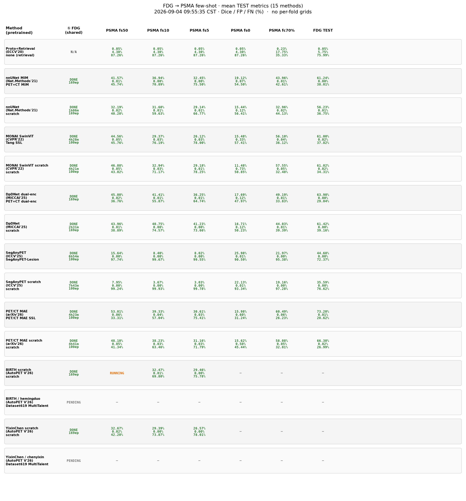

# fdg2psma-fewshot

Code and progress board for an **ICLR workshop** study on **FDG → PSMA** PET/CT lesion segmentation under **few-shot / zero-shot** transfer, comparing supervised baselines with representation-learning initializations (MAE, MIM, dual-encoder, etc.).

Aligned protocol: shared FDG supervised stage → PSMA `fs50` / `fs10` / `fs5` / `fs0` (+ `fc70%` and FDG TEST). Metrics are **Dice / FP / FN (%)** on TEST (Dice excludes empty-GT; FP=FP/Neg, FN=FN/Pos, voxel micro-average).

## Progress board (mean metrics)

Nine-fold grids, ETA, and queue / task-order footers are omitted below; see [`assets/board_summary.json`](assets/board_summary.json) for the numeric summary.



| Method | Pretrained | FDG | PSMA fs50 | PSMA fs10 | PSMA fs5 | PSMA fs0 | PSMA fc70% | FDG TEST |
| --- | --- | --- | --- | --- | --- | --- | --- | --- |
| Proto+Retrieval (ECCV'20) | none (retrieval) | N/A | 0.05%<br>4.30%<br>87.26% | 0.05%<br>4.30%<br>87.26% | 0.05%<br>4.30%<br>87.26% | 0.05%<br>4.30%<br>87.26% | 0.23%<br>17.75%<br>35.33% | 0.05%<br>5.75%<br>75.99% |
| nnUNet MIM (Nat.Methods'21) | PET+CT MIM | DONE<br>169ep | 41.57%<br>0.01%<br>45.74% | 36.94%<br>0.00%<br>70.89% | 32.45%<br>0.00%<br>75.50% | 19.12%<br>0.07%<br>54.50% | 43.96%<br>0.01%<br>42.61% | 61.24%<br>0.00%<br>38.01% |
| nnUNet (Nat.Methods'21) | scratch | DONE<br>1h06m<br>169ep | 32.19%<br>0.02%<br>40.20% | 31.60%<br>0.01%<br>59.63% | 29.14%<br>0.01%<br>66.77% | 15.44%<br>0.12%<br>56.41% | 32.96%<br>0.02%<br>44.13% | 56.23%<br>0.01%<br>36.75% |
| MONAI SwinViT (CVPR'22) | Tang SSL | DONE<br>4h28m<br>100ep | 44.56%<br>0.05%<br>45.76% | 29.37%<br>0.03%<br>76.19% | 26.12%<br>0.03%<br>78.00% | 15.48%<br>0.33%<br>57.41% | 56.10%<br>0.04%<br>36.12% | 61.00%<br>0.02%<br>37.82% |
| MONAI SwinViT scratch (CVPR'22) | scratch | DONE<br>4h21m<br>100ep | 46.08%<br>0.05%<br>43.02% | 32.94%<br>0.03%<br>71.17% | 29.18%<br>0.01%<br>78.25% | 11.48%<br>0.73%<br>50.85% | 57.55%<br>0.05%<br>32.48% | 61.02%<br>0.02%<br>34.31% |
| DpDNet dual-enc (MICCAI'25) | PET+CT dual-enc | DONE<br>169ep | 45.00%<br>0.02%<br>36.76% | 41.41%<br>0.01%<br>55.87% | 36.25%<br>0.01%<br>64.74% | 17.69%<br>0.12%<br>47.97% | 49.19%<br>0.01%<br>33.83% | 63.90%<br>0.00%<br>29.04% |
| DpDNet (MICCAI'25) | scratch | DONE<br>2h31m<br>169ep | 43.96%<br>0.01%<br>38.89% | 40.75%<br>0.00%<br>74.57% | 41.23%<br>0.00%<br>73.66% | 16.71%<br>0.12%<br>50.23% | 44.03%<br>0.01%<br>39.39% | 61.42%<br>0.00%<br>39.16% |
| SegAnyPET (ICCV'25) | SegAnyPET-Lesion | DONE<br>6h54m<br>100ep | 15.64%<br>0.00%<br>97.74% | 8.40%<br>0.00%<br>99.67% | 8.02%<br>0.00%<br>99.55% | 25.98%<br>0.01%<br>90.59% | 21.97%<br>0.00%<br>95.38% | 44.68%<br>0.00%<br>72.37% |
| SegAnyPET scratch (ICCV'25) | scratch | DONE<br>7h43m<br>100ep | 7.95%<br>0.00%<br>99.24% | 3.67%<br>0.00%<br>99.93% | 3.03%<br>0.00%<br>99.78% | 22.13%<br>0.01%<br>93.34% | 19.16%<br>0.00%<br>97.28% | 35.59%<br>0.00%<br>76.62% |
| PET/CT MAE (arXiv'26) | PET/CT MAE SSL | DONE<br>4h23m<br>100ep | 53.01%<br>0.06%<br>33.31% | 39.33%<br>0.04%<br>57.04% | 30.61%<br>0.03%<br>75.41% | 15.98%<br>0.60%<br>31.24% | 60.49%<br>0.06%<br>26.23% | 73.20%<br>0.01%<br>20.62% |
| PET/CT MAE scratch (arXiv'26) | scratch | DONE<br>4h41m<br>100ep | 48.10%<br>0.05%<br>41.34% | 38.23%<br>0.03%<br>63.46% | 31.16%<br>0.03%<br>71.79% | 15.62%<br>0.50%<br>45.44% | 58.08%<br>0.05%<br>32.01% | 66.30%<br>0.02%<br>26.99% |
| BIRTH scratch (AutoPET V'26) | scratch | DONE<br>169ep | RUNNING | 32.47%<br>0.01%<br>69.80% | 29.46%<br>0.00%<br>75.78% | — | — | — |
| BIRTH / hemingduo (AutoPET V'26) | Dataset619 MultiTalent | PENDING | — | — | — | — | — | — |
| YixinChen scratch (AutoPET V'26) | scratch | DONE<br>169ep | 32.67%<br>0.02%<br>42.20% | 29.39%<br>0.00%<br>73.87% | 26.57%<br>0.00%<br>78.01% | — | — | — |
| YixinChen / chenyixin (AutoPET V'26) | Dataset619 MultiTalent | PENDING | — | — | — | — | — | — |

Cells with three lines are **Dice / FP / FN**. Refresh the README figure from a live board JSON:

```bash
python3 scripts/export_readme_board.py \
  --board /path/to/iclr2026_aligned_fdg_fs50_f258_board.json \
  --png assets/progress_board.png \
  --out-json assets/board_summary.json \
  --out-md assets/board_table.md
```

## Workshop paper draft

ICLR 2027–style LaTeX draft (anonymous): [`paper/`](paper/) (`main.tex`, mean-metric figure, references).

```bash
cd paper && pdflatex main.tex && bibtex main && pdflatex main.tex && pdflatex main.tex
```

## Repository layout

| Path | Contents |
|------|----------|
| `scripts/` | Aligned board, split export, eval / ingest helpers |
| `run/` | Background launchers for FDG / PSMA few-shot stages |
| `data/` | Stratified & few-shot split JSONs (no NIfTI) |
| `3D-MAE-PET-CT/` | PET/CT MAE + downstream code (**no** `runs/` / weight blobs) |
| `third_party/` | Local mirrors of compared methods (SegAnyPET, DpDNet, AutoPET V entries, …) |
| `nnunet_ext_trainers/` | Custom nnU-Net trainers used by the aligned protocol |
| `PROTOCOL.md` | Local experiment notes (paths may refer to an internal workspace) |
| `assets/` | README board image + sanitized mean-metric JSON |

**Not** published here: raw PET/CT volumes, training caches, checkpoints, or per-fold prediction shards.

## Data & compute notes

- Imaging data follow the AutoPET-style PET/CT layout used in our internal `dataset1` stratified split (`data/splits_stratified_70_10_20.json`).
- Many launchers assume env vars such as `TASK1_BASE` / a workspace root; adapt absolute paths in `scripts/iclr2026_aligned_fdg_fs50_board.py` before running locally.
- Third-party code retains upstream licenses; see each subdirectory.

## License

Apache-2.0 (see [`LICENSE`](LICENSE)), except where `third_party/` components specify otherwise.
